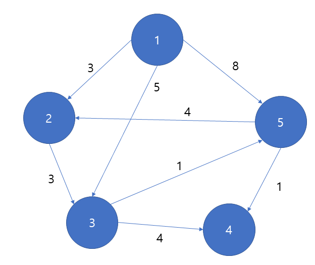

# 다익스트라 알고리즘
최단경로를 구하는 알고리즘
* 하나의 정점에서 다른 모든 정점까지의 각각의 최단거리를 구한다.

1. 로직

   * 첫 정점을 기준으로 연결되어있는 정점들을 추가해 가면서 최단거리를 갱신
   * 대부분 우선순위 큐(or minheapq)를 활용하여 구현함
    1) 출발점이 되는 정점을 기준으로 배열을 선언하여 첫 정점에서 각 정점까지의 거리를 저장  
       * 첫 정점의 거리는 0, 나머지는 무한대(충분히 큰 값)로 저장함
       * 큐에 (정점, 0(현재거리)) 만 먼저 넣음
    2) 큐에서 노드를 꺼냄  
       * 꺼낸 노드에 인접한 노드들에 대해 각 노드들에 가는 거리와 현재 배열에 저장되어있는 거리를 비교한다. 
       * 배열에 저장된 거리보다 인접노드로 가는 거리가 짧을 경우 배열의 거리를 업데이트하고 큐에 해당하는 노드와 거리를 넣는다.
    3) 2번의 과정을 큐에 노드가 하나도 없을 때 까지 반복
2. 예시  

1. 배열을 만들고 기준이 되는 1을 제외한 나머지 노드들을 inf 로 설정하고, 큐에 입력

|1|2|3|4|5|큐|
|:-:|:-:|:-:|:-:|:-:|:-:|
|0|inf|inf|inf|inf|[1,0]|

2. 큐에서 노드를 뽑아내고 그 노드에 인접한 거리로 업데이트, 업데이트한 노드들을 큐에 입력

|1|2|3|4|5|큐|
|:-:|:-:|:-:|:-:|:-:|:-:|
|0|3|5|inf|8|[2,3],[3,5],[5,8]|  

3. [2,3]을 노드로 부터 가져오고 2번노드에 인접한 노드를 비교(3번노드에 3만큼의 거리를 가지고 있지만 실질적인 거리는 3+3 = 6 (현재의 거리 + 인접노드의 거리) 이기 때문에 업데이트 하지 않음)

|1|2|3|4|5|큐|
|:-:|:-:|:-:|:-:|:-:|:-:|
|0|3|5|inf|8|[3,5],[5,8]|  

4. [3,5]를 가져오고 3번노드에 인접한 노드를 비교하고, 업데이트함  

|1|2|3|4|5|큐|
|:-:|:-:|:-:|:-:|:-:|:-:|
|0|3|5|9|6|[5,6],[5,8],[4,9]|  

5. [5,6]을 가져오고 5번노드에 인접한 노드를 비교하고 업데이트함  

|1|2|3|4|5|큐|
|:-:|:-:|:-:|:-:|:-:|:-:|
|0|3|5|7|6|[4,7],[5,8],[4,9]|  

6. 큐에 데이터가 없을때 까지 뽑으면서 비교(이미 최소달성함)