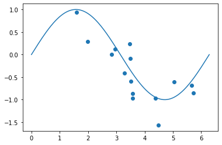

# 머신러닝 기초
## 0. Machine Learning(기계학습) 이란?
* 경험을 통해 자동으로 개선하는 컴퓨터 알고리즘
* 학습데이터를 통해 목표값(target)을 예측하는 함수 $y(x)$ 를 최적화 시키는 학습

## 1. 머신러닝의 핵심 개념
* 학습단계(training phase) : 함수를 학습데이터에 기반하여 최적화 하는 단계
* 테스트셋(test set) : 모델을 평가하기 위해서 사용하는 데이터
* 일반화 : 학습단계에서 사용되지않은 새로운 데이터에 대하여 바르게 측정할 수 있는 역량(test set으로 수행하는 평가항목)
* 지도학습(supervised learning) : target이 주어진경우
  * 분류(classification)
  * 회귀(regression)
* 비지도학습(unsupervised learning) : target이 주어지지 않는경우
  * 군집(clustering)
* 강화학습(Reinforcement learning) : 행동에 의한 가중치를 통한 최적 행동 학습

## 2. 기초
* 다항식 곡선 근사(Polynomail Curve Fitting)(다항식 회귀분석)
  * 주어진 입력벡터로 다항식을 예측하는것

Ex) 아래의 점들로 sin곡선을 예측하여야한다!  

  

아래와 같은 식을 사용한다. 입력받는 x에 대하여 최적화된 파라미터 $\mathbf{w}$를 찾는것이 목표이다.

$$
y(x,\mathbf{w}) = w_{0} + w_1x+w_2x^2 + ... + w_Mx^M = \sum_{j=0}^{M}w_jx^j
$$

* 오차함수(Error Function)
  